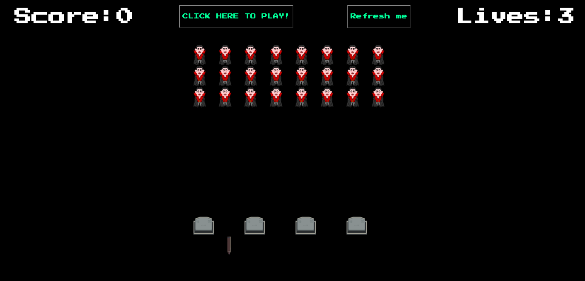

# Space Invaders - GA Project One

### Goal and timeframe 

- To build a functioning browser game wih pure JavaScript in 8 days. 

#### Game Overview

During lockdown I found myself rewatching all the classics - Buffy was top of the list. This is a Space Invaders inspired game with a Buffy twist. The aim is to shoot or 'dust' as many vampires as possile whilst dodging the hearts that are randomly being thrown. In order to win the player must dust all the vampires before they reach the bottom on the grid. The player has three lives for every heart that hits the player a life is lost. The player can dodge the hearts by hiding behind a graves but once the graves are hit by the hearts they disappear making it more challenging for the player to dodge them. 



### Technologies Used

- HTML
- CSS
- JavaScript
- Git 
- GitHub

### Process

This game was the first I had ever created, so I spent the first day creating wireframes and writing pseudo code. I wanted to make sure I had a realistic MVP with fully functioning functionality.<br>
- I started with building the grid with a for loop. 
- I moved onto creating an array for the vampire invaders and working on their movement logic.

```
  function moveVamps() {
    startAllHearts = setInterval(() => startHearts(), 4000)
    clearInterval(moveVampsTimer)
    moveVampsTimer = setInterval(() => {
      removeVamps()
      vamps = vamps.map(vamp => {
        return vamp + 1
      })
      addVamps()
    }, 1000)
  }
```

- Keydown event listeners getting player movement on the spike, allowing them to move left/right and fire on spacebar.
- Creating the shooting bleeding heart from the vampires was next, this is where the timers came in. The vampires now move across the grid whilst shooting hearts, if the heart hit a grave the grave would be removed using splice. If the heart hit a gun (player) a life wouldbe lost. 

```
function moveHearts(heartId) {
    const currentPosition = hearts[heartId].location
    cells[currentPosition].classList.remove('heart')
    const newPosition = currentPosition + 10
    if (cells[newPosition].classList.contains('grave')) {
      cells[newPosition].classList.remove('grave')
      graves.splice(graves.indexOf(newPosition), 1)
      clearInterval(hearts[heartId].timer)
      return delete hearts[heartId]
    }
    if (cells[newPosition].classList.contains('gun')) {
      removeLives(newPosition)
      clearInterval(hearts[heartId].timer)
      return delete hearts[heartId]
    }
    if (cells[currentPosition].classList.contains('sword')) {
      cells[newPosition].classList.remove('sword')
      clearInterval(hearts[heartId].timer)
      return delete hearts[heartId]
    }
    cells[newPosition].classList.add('heart')
    hearts[heartId].location = newPosition
  }
```
- If the vamps got to the graves or player before the player had shot them down whoWon() logical was called to determine who had won. 
- I worked on score keepping after this. 


### Challenges 
 - Collision logic.
 - Ensuring the timers were working properly.

### Reflection & Key Learnings 

Selecting a Space Invaders type of game seemed like the logical option for me as it this game allowed me to work on my JavaScript basics: array manipulation, methods, objects. Working with setTimers is challenge due to the buggy nature of having many being used at once. 

- Writing functions in vanilla JavaScript.
- The importance of planning, creating wireframes and writing pseudocode

### Known Bugs & Future Features 
- The timers go a bit awry and send hearts out twice the spead than they are set to. 
- Graves break down instead of disappearing after one hit 


